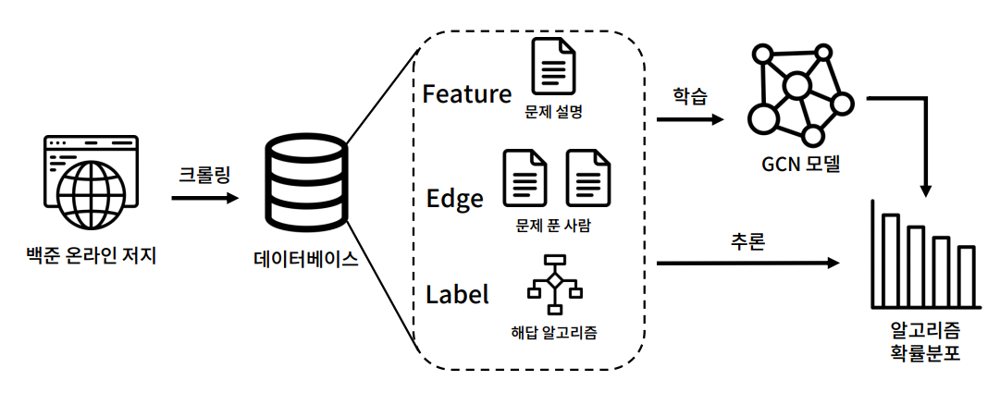

# AlgoTag: 문제 해결 알고리즘 자동 분류기
##### 박민솔, 백인규

## Problem Statement

### "알고리즘 문제의 해답 알고리즘을 예측하자"

#### 문제 상황

 초심자에게는, 알고리즘 문제의 문제 설명을 읽어도 어떤 알고리즘으로 해결해야 하는지 쉽게 떠오르지 않는 경우가 많다.
 그렇기 때문에 문제 설명 및 부가적인 정보를 토대로 해답 알고리즘을 제시해주는 예측 모델을 만들고자 한다.

#### 기존 접근법

 풀이자의 경험과 지식을 기반으로 수동으로 알고리즘을 예측하는 방법이 있다.
 ChatGPT 등의 언어 모델에게 Prompt 를 통해 풀이를 요구하는 방법도 있으나 정확도가 매우 낮다.

#### 우리의 접근법 (요약 설명)

 백준 온라인 저지 (Baekjoon Online Judge) 에서 알고리즘 분류를 제공하는 문제를 대상으로, 각 문제를 정점으로 한 그래프를 구축함
 문제의 정답 문제 설명과 부가 정보를 통해 정점의 feature 를 추출한다 . 이후 GCN 을 통해 알고리즘 분류를 예측하는 모델을 학습한다

## Approach

#### 데이터셋 구축

 알고리즘 분류를 제공하는 , 랜덤하게 뽑은 1,000 문제를 대상으로 다음을 크롤링
 문제 설명과 부가 정보 (정답 코드의 평균 길이 등)(Feature), 문제를 공통으로 푼 유저수 (Edge), 정답 알고리즘 (Label)

#### 학습 및 추론

 위에서 구축한 그래프 데이터 중 일부를 Graph Convolutional Network(GCN) 에 학습시킨 후 , 나머지 데이터로 평가